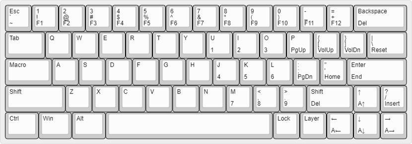

# dz60arrow
Custom 60% layout for DZ60 PCB with inbuilt arrow keys, ditching RAlt, Menu, RWin, and potentially RShift in a later revision.  Layer-based underglow control and a macro key are currently implemented.

# Layout

# Build
To build with QMK, copy `/keyboards` into QMK directory, then run
>make dz60:dz60arrow
